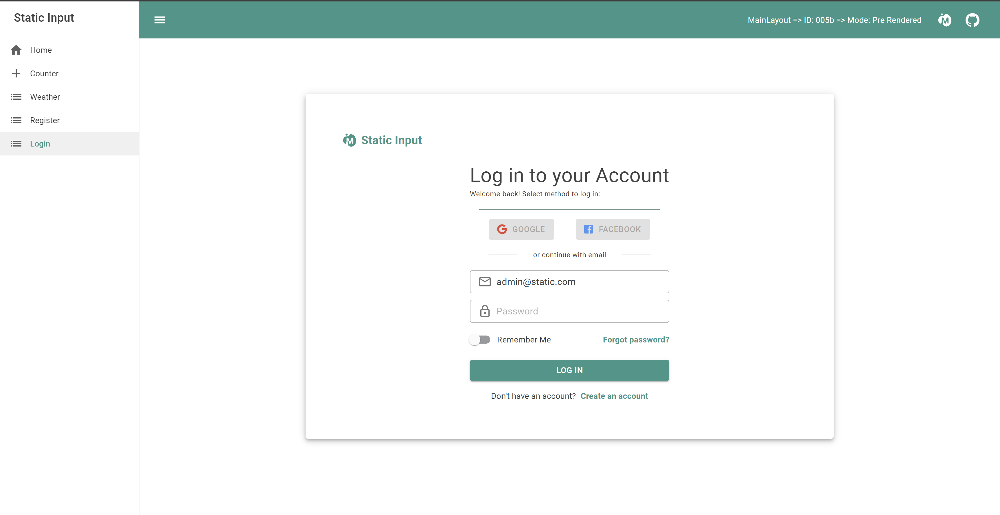

<p align="center">
  
  <h1 align="center">MudBlazor.StaticInput</h1>
</p>

## :book: Introduction :book:
**MudBlazor.StaticInput** is an extension package for the [MudBlazor](https://github.com/MudBlazor/MudBlazor) library.  
Tailored specifically for [Static Server-Side Rendered](https://learn.microsoft.com/en-us/aspnet/core/blazor/components/render-modes?view=aspnetcore-8.0#static-server-side-rendering-static-ssr) (static SSR) pages. It offers seamless integration of MudBlazor's Component design into your applications. Focusing particularly on components designed for forms and edit forms, in situations where [interactive](https://learn.microsoft.com/en-us/aspnet/core/blazor/components/render-modes?view=aspnetcore-8.0#render-modes) components are not feasible.  
[*example*: [Blazor Identity UI](https://learn.microsoft.com/en-us/aspnet/core/blazor/security/server/?view=aspnetcore-8.0&tabs=visual-studio#blazor-identity-ui-individual-accounts)].

<a href="https://github.com/0phois/MudBlazor.StaticInput/tree/master/demo/StaticSample">
  
</a>

## :thinking: Why MudBlazor.StaticInput? :thinking:
- **Rapid SSSR Integration:** Effortlessly add MudBlazor components to your static SSR pages, saving development time.
- **Focus on Forms:** Streamline development of forms and edit forms, for use cases such as Microsoft Identity Login forms.
- **Preserved Look & Feel:** Maintains the consistent design and user experience of MudBlazor. Ensuring uniformity across all pages.
- **Maintains Flexibility:** By inheriting core MudBlazor components, StaticInput maintains the same flexibility as the original components.


## :gift: What's Included :gift:
The set of components and features may extend over time. Currently, Static Input Components includes:  
### MudStaticButton
<details>
  <summary>
    A Material Design button that supports form actions such as 'submit' and 'reset'
  </summary>  

```html  
<MudStaticButton Variant="Variant.Filled" Color="Color.Primary">Login</MudStaticButton>
```
</details>  

> Note: `<MudButton>` is 100% functional in forms when used correctly. The static component simply assists in assuring the correct usage. 

### MudStaticCheckBox
<details>
  <summary>
    Checkboxes are a great way to allow the user to make a selection of choices.
  </summary>

```html
<MudStaticCheckBox @bind-Value="@RememberMe" Color="Color.Success">Remember Me</MudStaticCheckBox>
```
```cs
@code{
    public bool RememberMe { get; set; }
}
```
</details>

### MudStaticSwitch
<details>
  <summary>
    Similar to a checkbox but visually different. The switch lets the user <i>switch</i> between two values with the tap of a button.
  </summary>  

```html
<MudStaticSwitch @bind-Value="@RememberMe" Color="Color.Success" UnCheckedColor="Color.Primary">Remember Me</MudStaticSwitch>
```
```cs
@code{
    public bool RememberMe { get; set; }
}
```
</details>  

### MudStaticTextField
<details>
  <summary>
    Text field components are used for receiving user provided information
  </summary>

```html
<MudTextField @bind-Value="Password" Label="Password" Variant="Variant.Outlined" InputType="InputType.Password" 
              Adornment="Adornment.End" AdornmentIcon="@PasswordInputIcon"/>
```
```cs
@code {
    public string Password { get; set; }
}
```
</details>  

  
## :rocket: Getting Started :rocket:
To start using MudBlazor.StaticInput in your projects, simply install the package via NuGet Package Manager:
```bash
dotnet add package Extensions.MudBlazor.StaticInput
```
> Note: MudBlazor should already be setup for your application
